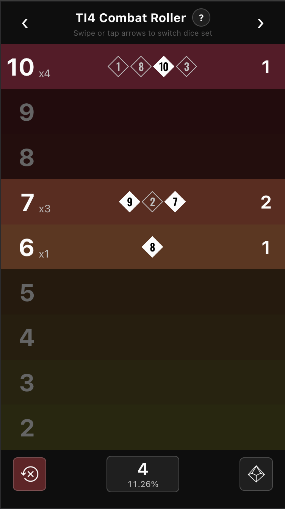
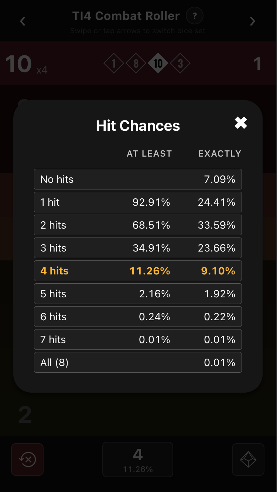

# TI4 Combat Roller

Web app to set up and roll [Twilight Imperium 4](https://boardgamegeek.com/boardgame/233078/twilight-imperium-fourth-edition) combat dice.

Live: <https://ti4combatroller.adrianocola.com>

| Main dice screen             | Hit chances modal             |
| ---------------------------- | ----------------------------- |
|  |  |

## Features

- Dice grouped by unit combat value (10 down to 2).
- Tap the right half of a row to add a die; tap the left half to remove one.
- Roll button rolls all dice in the current set; reset clears them.
- Total hits + cumulative hit chance shown in the bottom bar; tap to open the full hit-chance table.
- 5 color sets — switch via swipe, header arrows, ← / → keys, or shift + mouse wheel.
- Each color set keeps its own dice (useful for rolling attack and defense in parallel).
- Responsive layout for mobile and desktop, plus iOS safe-area insets.

## Develop

Requirements:

- [Node.js](https://nodejs.org/) (see `.nvmrc`)
- [pnpm](https://pnpm.io/)

Built with [Vite](https://vitejs.dev/), [React 19](https://react.dev/), [Tailwind CSS v4](https://tailwindcss.com/), [Redux Toolkit](https://redux-toolkit.js.org/), and [Framer Motion](https://www.framer.com/motion/).

```shell
git clone https://github.com/adrianocola/ti4-combat-roller
cd ti4-combat-roller
pnpm install

# Optional analytics + random-number API endpoint
cp .env.sample .env.local

pnpm dev      # start Vite dev server (http://localhost:5173)
```

### Random integers API (optional)

`netlify/functions/random.ts` is a Netlify Function that proxies [random.org](https://api.random.org)'s `generateIntegers` endpoint. The app calls it via `VITE_PUBLIC_API_ENDPOINT` (default `/api/random`) to top up its local cache of random faces; if the endpoint is unset, the upstream is unreachable, or the cache runs out, the app falls back to `Math.random()`.

To enable: set the `RANDOMORG_API_KEY` env var in Netlify (Site settings → Environment) and run `netlify dev` locally to test the function.
